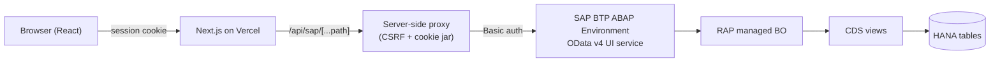

# ProcureFlow

SAP-backed procurement approval workflow. Employees raise purchase
requisitions; managers approve or reject them; approved requisitions convert
into purchase orders — backed by a real SAP RAP business object on SAP BTP
ABAP Environment, with a Next.js frontend.


## Architecture



Key decisions:
- **Proxy pattern**: the browser never talks to SAP directly. `/api/sap/[...path]` centralizes CSRF token handling, cookie replay, and error normalization.
- **RAP managed** implementation, `strict(2)`: framework-generated CRUD + four custom actions (`SubmitForApproval`, `Approve`, `Reject`, `CreatePurchaseOrder`).
- Two demo users (`requestor@demo` / `approver@demo`), one shared SAP technical communication user.

## Repo layout

```
abap/       ABAP source (authored here, activated manually in Eclipse ADT)
web/        Next.js 14+ App Router, TypeScript strict, Tailwind v4
docs/       Phase verification records, redeploy runbook, demo script
```

## Local setup (mock mode — no SAP needed)

```bash
cd web
pnpm install
cp .env.example .env.local   # defaults are fine for mock mode
echo "MOCK_SAP=1" >> .env.local
pnpm dev
```

Sign in at `http://localhost:3000/login` with `requestor@demo` / `demo1234`
or `approver@demo` / `demo1234`. In mock mode, all SAP calls are served by an
in-memory fixture store (`web/src/mocks/`) via MSW — no live BTP connection
required.

## Tests

```bash
cd web
pnpm lint            # eslint
pnpm typecheck        # tsc --noEmit
pnpm test             # vitest (unit + integration, MSW-mocked)
pnpm e2e               # playwright, mock mode
pnpm e2e:live           # playwright @live — needs a running BTP system + .env
node scripts/sap-smoke.mjs   # live API smoke test — needs .env
```

## Live SAP backend

The ABAP source lives in [`abap/`](abap/) and is authored here, but SAP BTP
ABAP Environment objects have to be created and activated manually in
Eclipse ADT — there's no CLI/API path to push ABAP source straight into a
BTP tenant. See:
- [`abap/MANIFEST.md`](abap/MANIFEST.md) — object creation order.
- [`docs/REDEPLOY.md`](docs/REDEPLOY.md) — full runbook to recreate the
  backend after a BTP trial reset (trial systems can be deleted).
- BTP trial systems hibernate nightly — start the system in the BTP cockpit
  before a live demo.

## Demo

See [`docs/DEMO.md`](docs/DEMO.md) for a 3-minute walkthrough script.
